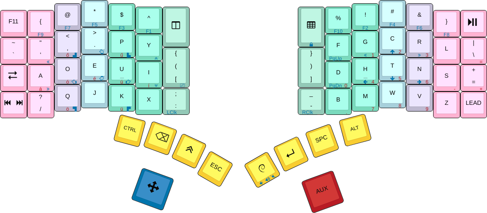
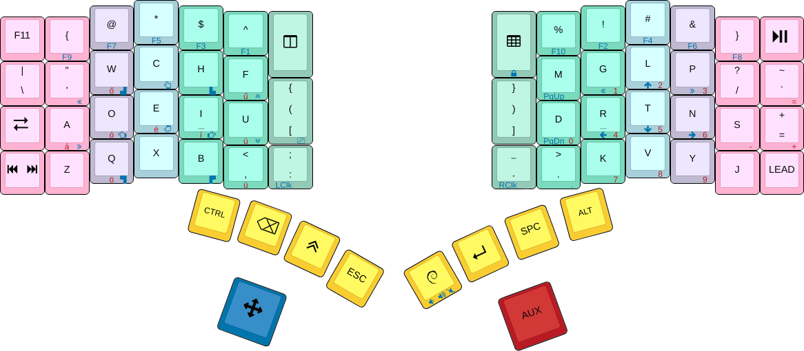

<!-- -*- mode: markdown; fill-column: 8192 -*- -->

algernon's Keyboardio Model01 firmware
======================================

This is my work in progress firmware Sketch for the [Keyboardio Model 01][kbdio], using the [KeyboardioFirmware][kbfw] together with a fair amount of plugins.

This is a reasonably complete example of how to work with the firmware, and surrounding libraries, to extend it, to compose the various components, to have something useful in the end.

 [kbfw]: https://github.com/keyboardio/KeyboardioFirmware
 [kbdio]: https://shop.keyboard.io/

It is a heavy work in progress, with some awful hacks and workarounds here and there. Eventually these will be cleaned up.

It is based on my previous [ErgoDox EZ layout][ergodox-layout], a lot of things are common between the two.

 [ergodox-layout]: https://github.com/algernon/ergodox-layout

## Table of Contents

* [Layouts](#layouts)
    - [Base layer](#base-layer)
    - [ADORE layer](#adore-layer)
* [Special features](#special-features)
    - [Symbolic Unicode Input](#symbolic-unicode-input)
* [License](#license)

# Layouts

## Base layer

This is a [Dvorak][dvorak]-inspired layout, with some changes here and there, to make it more suited for programming, and for a non-traditional keyboard.

 [dvorak]: https://en.wikipedia.org/wiki/Dvorak_Simplified_Keyboard

* Keys with blue front-prints are activated by tapping or holding the left palm key (also colored blue).
* Keys with red front-prints are activated by tapping or holding the right palm key (also colored red).
* The `Alt`, `Control`, `Shift` modifiers are all [one-shot][akela:oneshot], and so are the two palm keys.
* The LED colors are governed by the [Colormap][akela:colormap] plugin for the most part:
  - By default, the modifiers and palm keys are highlighted with different colors.
  - On different layers, the keys that have changed behaviour, are colored differently.
  - When a modifier is active, the [LED-ActiveModColor][akela:led-activemodcolor] plugin turns it white.
  - A blazing trail effect is provided by [LED-Stalker][akela:led-stalker].
  - One can also switch LEDs off, or switch to a [Heatmap][akela:heatmap], a [rainbow effect][keyboardio:rainbow], or a [chase effect][keyboardio:chase].
* The number row was inspired by [Programmer Dvorak][dvorak:prg]: the odd and even numbers are on separate side, instead of the traditional ascending order spanning both sides. Unlike Programmer Dvorak, numbers are accessible without using `Shift`. The symbols atop each number however, are replaced almost everywhere, using the [ShapeShifter][akela:shapeshifter] plugin. Symbols used more often are placed at positions with easier access.
* The `R0C6` and `R0C9` keys are to control `tmux` and `screen`, and are dependent on my tmux setup.
* The `R1C6` and `R1C9` keys are [tap-dance][akela:tap-dance] keys. Tapped once, they input `[{`/`}]` (without and with `Shift`, respectively). Tapped twice, they input `(`/`)`.
* The `LEAD` keys is a [leader key][akela:leader], with the following sequences built-in:
  - `LEAD u` starts the [symbolic unicode input](#symbolic-unicode-input) method.
  - `LEAD y` types `\o/`.
  - `LEAD s` does a lot of magic to type a shruggy: `¯ \_(ツ )_/¯`.
  - `LEAD LEAD` switches to the next LED mode.
* The `R0C7` key is also a [tap-dance][akela:tap-dance] key, which inputs `:` on a single tap, `;` otherwise.
* The `R3C8` key (another [tap-dance][akela:tap-dance] key) acts as a `GUI` key when tapped once. When tapped once, it swithes to a special `APPSEL` layer, where the number row on the left half can be used to select an application to switch to. This needs a helper program on the host side.
* There are a few other actions one can trigger with [magic combos][akela:magic-combos]:
  - `PALMS + A`: Switch to the [ADORE](#adore-layer).
* We are also using [mouse keys][keyboardio:mouse-keys], [macros][keyboardio:macros] for some of the features.

  [dvorak:prg]: http://www.kaufmann.no/roland/dvorak/
  [akela:shapeshifter]: https://github.com/keyboardio/Akela-ShapeShifter
  [akela:oneshot]: https://github.com/keyboardio/Akela-OneShot
  [akela:colormap]: https://github.com/keyboardio/Akela-Colormap
  [akela:led-activemodcolor]: https://github.com/keyboardio/Akela-LED-ActiveModColor
  [akela:led-stalker]: https://github.com/keyboardio/Akela-LED-Stalker
  [akela:heatmap]: https://github.com/keyboardio/Akela-Heatmap
  [keyboardio:rainbow]: https://github.com/keyboardio/Keyboardio-LEDEffect-Rainbow
  [keyboardio:chase]: https://github.com/keyboardio/Keyboardio-LEDEffect-Chase
  [akela:tap-dance]: https://github.com/keyboardio/Akela-TapDance
  [akela:leader]: https://github.com/keyboardio/Akela-Leader
  [akela:magic-combos]: https://github.com/keyboardio/Akela-MagicCombo
  [keyboardio:mouse-keys]: https://github.com/keyboardio/Keyboardio-MouseKeys
  [keyboardio:macros]: https://github.com/keyboardio/Keyboardio-Macros
  
## ADORE layer

A heavy work in progress. The main difference is in the layout of alphanumerics, but most other things work as on the [base layer](#base-layer).

# Special features

## Symbolic Unicode Input

Once in the Symbolic Unicode Input mode (implemented by using the [Syster][akela:syster] plugin), one is able to type in symbol names, press `Space`, and get the Unicode symbol itself back. When in the mode, `⌨` is printed first. Once the sequence is finished, all of it is erased by sending enough `Backspace` taps, and the firmware starts the OS-specific unicode input sequence. Then, it looks up the symbol name, and enters the associated code.

 [akela:syster]: https://github.com/keyboardio/Akela-Syster

For the list of supported symbols, please see the source.

This is an experimental feature, and may or may not work reliably.

# License

The code is released under the terms of the GNU GPL, version 3 or later. See the
COPYING file for details.
